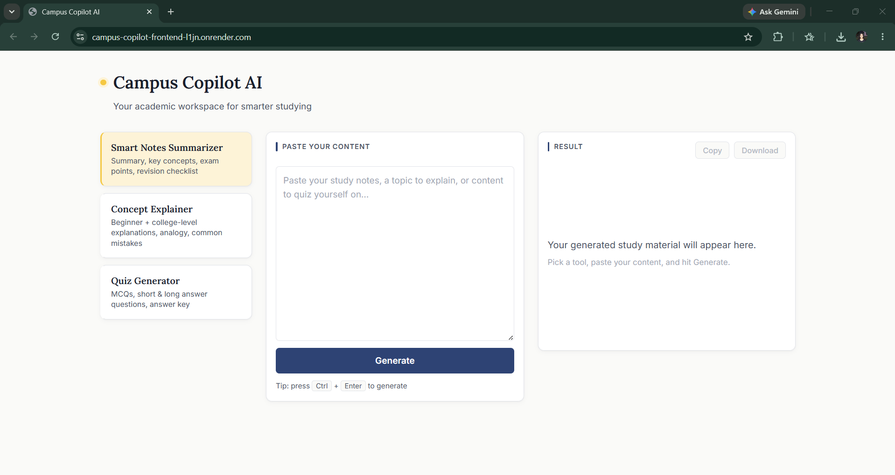

# Campus Copilot AI

> **An AI-powered academic workspace for college students.**
>
> Rather than functioning as a general chatbot, Campus Copilot AI provides dedicated academic tools that transform study material into structured learning resources using an OpenAI-compatible Large Language Model.

---

## Live Demo

**Frontend**

```
https://campus-copilot-frontend-l1jn.onrender.com/
```

**Backend Health Check**

```
https://campus-copilot-ai-49j4.onrender.com/api/health
```

---

## Features

- 📄 Smart Notes Summarizer
- 💡 Concept Explainer
- ❓ Quiz Generator
- ⚡ Real-time AI response streaming using Server-Sent Events (SSE)
- 📋 Copy generated responses
- 📥 Download generated responses
- 🔒 Secure backend proxy (API keys never exposed to the client)
- 🐳 Dockerized backend
- ☁️ Cloud deployment on Render
- 🧩 Modular prompt architecture for easy feature expansion

---

## Screenshots

### Home Page



The main interface of Campus Copilot AI, featuring the three AI-powered academic tools, content input area, and streamed response panel.

---

### Smart Notes Summarizer


Converts lengthy study material into concise summaries with key concepts, exam points, and revision checklists.

---

### Concept Explainer


Explains difficult topics using beginner-friendly and college-level explanations, real-world analogies, and common misconceptions.

---

### Quiz Generator


Generates multiple-choice, short-answer, and long-answer questions with answer keys for effective revision.

---

# Technology Stack

### Frontend

- HTML5
- CSS3
- Vanilla JavaScript

### Backend

- Node.js
- Express.js

### AI

- OpenAI-Compatible API
- Configurable model through environment variables

### Deployment

- Docker
- Render

### Development

- Git
- GitHub
- Visual Studio Code

---

# What It Does

Campus Copilot AI provides three specialized academic tools built around a single workflow:

> **Paste study material → Select a tool → Receive a streamed AI-generated result**

### Smart Notes Summarizer

Transforms lengthy academic material into concise, structured summaries including:

- Key concepts
- Important points
- Examination-focused highlights
- Revision checklist

---

### Concept Explainer

Explains difficult topics at multiple levels of depth, including:

- Beginner-friendly explanation
- College-level explanation
- Real-world analogy
- Common misconceptions
- Quick recap

---

### Quiz Generator

Generates revision material consisting of:

- Multiple Choice Questions (MCQs)
- Short Answer Questions
- Long Answer Questions
- Complete Answer Key

---

# Project Structure

```text
campus-copilot-ai/
│
├── backend/
│
│   ├── src/
│   │
│   ├── prompts/
│   │   ├── summarizer.js
│   │   ├── explainer.js
│   │   ├── quiz.js
│   │   └── registry.js
│   │
│   ├── services/
│   │   └── llmService.js
│   │
│   ├── routes/
│   │   └── generateRoute.js
│   │
│   ├── middleware/
│   │
│   ├── utils/
│   │
│   ├── config/
│   │   └── env.js
│   │
│   └── server.js
│
├── frontend/
│
│   ├── css/
│   ├── js/
│   │   ├── generator.js
│   │   ├── output.js
│   │   ├── sse.js
│   │   ├── toolSelector.js
│   │   └── ...
│   │
│   └── index.html
│
├── README.md
├── LICENSE
└── .gitignore
```

---

# Architecture

The project follows a modular client-server architecture.

```text
User
   │
   ▼
Frontend (Static Site)
   │
HTTPS + SSE
   │
   ▼
Backend (Express API)
   │
Prompt Templates
   │
LLM Service
   │
HTTPS
   │
   ▼
OpenAI-Compatible API
```

---

# Backend Architecture

The backend is the only component responsible for communicating with the AI provider.

### `prompts/`

Contains one prompt template per academic tool along with a registry that maps tool names to prompt templates.

---

### `services/llmService.js`

The only module responsible for communicating with the OpenAI-compatible API.

Responsibilities include:

- API communication
- Streaming token processing
- Request timeout handling

---

### `routes/generateRoute.js`

Implements a single action endpoint:

```
POST /api/generate
```

Incoming requests are validated and dispatched to the appropriate prompt template.

---

### `middleware/`

Contains middleware responsible for:

- Request validation
- Security headers
- Error handling

---

### `utils/`

Utility modules including:

- SSE wire-format writer
- Logger

---

### `config/env.js`

Loads and validates environment variables during startup.

The application fails fast if required configuration is missing.

---

# Frontend Architecture

The frontend intentionally uses **vanilla JavaScript** with no framework or build step.

### `sse.js`

Handles the Server-Sent Events streaming protocol.

---

### `generator.js`

Coordinates generation requests.

---

### `output.js`

Responsible for:

- Rendering streamed responses
- Formatting headings and lists
- Copy functionality
- Download functionality

---

### `toolSelector.js`

Handles academic tool selection and UI state.

---

# Key Architectural Decisions

### Single Action Endpoint

Instead of implementing one endpoint per AI tool, the backend exposes a single endpoint:

```
POST /api/generate
```

The selected tool is passed in the request body.

This design allows new AI tools to be added by introducing a new prompt module rather than creating additional API routes.

---

### Stateless Architecture

The application maintains:

- No database
- No user sessions
- No conversation history

Each request is processed independently.

---

### Prompt Separation

Prompt templates are intentionally separated from application logic.

This keeps prompt engineering independent from API communication and simplifies future maintenance.

---

### Server-Sent Events (SSE)

Responses are streamed progressively to the frontend.

Users begin reading generated content immediately rather than waiting for the entire response.

---

### Minimal Dependencies

Backend:

- express
- cors
- dotenv

Frontend:

- No external dependencies

---

# Quick Start

Follow these steps to run Campus Copilot AI on your local machine.

## Prerequisites

Make sure the following software is installed:

- Node.js (v18 or later recommended)
- npm
- Git

You will also need an OpenAI-compatible API key.

---

## 1. Clone the Repository

```bash
git clone https://github.com/Prajna-Pahari/campus-copilot-ai.git

cd campus-copilot-ai
```

---

## 2. Configure the Backend

Navigate to the backend directory:

```bash
cd backend
```

Install dependencies:

```bash
npm install
```

Create a `.env` file by copying the example configuration:

```bash
cp .env.example .env
```

Open the `.env` file and add your API key:

```env
OPENAI_API_KEY=your_api_key_here

# Optional
OPENAI_MODEL=gpt-4o-mini
OPENAI_BASE_URL=https://api.openai.com/v1
PORT=5000
FRONTEND_ORIGIN=http://localhost:5500
```

---

## 3. Start the Backend

```bash
npm run dev
```

The backend will start at:

```
http://localhost:5000
```

You can verify that it is running by opening:

```
http://localhost:5000/api/health
```

---

## 4. Run the Frontend

Open a new terminal.

Navigate to the frontend directory:

```bash
cd frontend
```

Start a local web server:

```bash
npx serve -l 5500
```

The frontend will be available at:

```
http://localhost:5500
```

---

## 5. Start Using Campus Copilot AI

1. Open `http://localhost:5500` in your browser.
2. Select one of the available academic tools.
3. Paste your study material.
4. Click **Generate**.
5. Watch the AI response stream in real time.

---

## Project Structure

```text
campus-copilot-ai/
├── backend/
├── frontend/
├── docs/
├── README.md
└── LICENSE
```

---

## Troubleshooting

### Backend won't start

- Ensure your `.env` file exists inside the `backend` directory.
- Verify that `OPENAI_API_KEY` is correctly configured.

### Frontend cannot connect to the backend

- Ensure the backend is running on `http://localhost:5000`.
- Verify that `FRONTEND_ORIGIN` in the backend `.env` matches your frontend URL.

### Port already in use

If port `5000` or `5500` is occupied, stop the conflicting process or update the port configuration accordingly.

---

# Running with Docker

```bash
cd backend

docker build -t campus-copilot-backend .

docker run \
  -p 5000:5000 \
  --env-file .env \
  campus-copilot-backend
```

The Docker image is:

- Alpine-based
- Single-stage
- Runs as a non-root user

---

# API

## Generate Content

**POST**

```
/api/generate
```

Request body:

```json
{
  "tool": "summarizer",
  "content": "..."
}
```

Supported tool values:

- `summarizer`
- `explainer`
- `quiz`

Returns a streamed `text/event-stream` response consisting of:

```text
data: {"token":"..."}

...

data: {"done":true}
```

If generation fails:

```text
data: {"error":"..."}
```

---

## Health Check

**GET**

```
/api/health
```

Used by Docker and cloud platforms for liveness checks.

---

# Environment Variables

See:

```
backend/.env.example
```

Required:

```env
OPENAI_API_KEY=
```

Optional configuration includes:

```env
OPENAI_MODEL=
OPENAI_BASE_URL=
PORT=
FRONTEND_ORIGIN=
```

The server refuses to start if required configuration is missing.

---

# Status

The application is fully functional and deployed.

### Completed

- ✅ AI integration
- ✅ Prompt engineering
- ✅ Secure backend proxy
- ✅ Server-Sent Events streaming
- ✅ Docker containerization
- ✅ Cloud deployment
- ✅ Production security headers
- ✅ Graceful shutdown
- ✅ Structured logging
- ✅ Request timeout handling

### Planned

- API rate limiting
- GitHub Actions CI pipeline
- User authentication
- Study history
- PDF upload support
- OCR for handwritten notes

---

# License

This project is licensed under the **MIT License**.

See the [LICENSE](https://github.com/Prajna-Pahari/campus-copilot-ai/blob/main/LICENSE) file for details.
